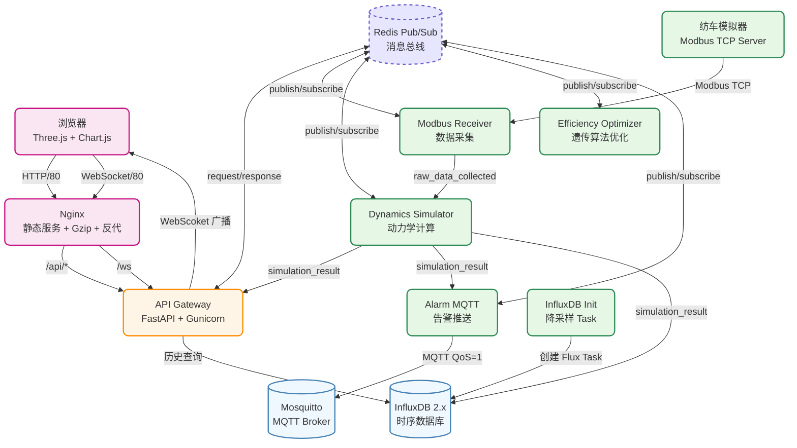

# 元代水转大纺车动力学仿真与能效分析系统 v1.2.0

> **古代纺织技术的数字化复刻**：基于 Modbus 真实工业协议、欧拉-艾特尔魏因皮带打滑模型、遗传算法多目标优化、Three.js 实时三维渲染的全栈仿真系统。

---

## 目录

- [系统架构](#系统架构)
- [模块说明](#模块说明)
- [快速开始](#快速开始)
- [API 接口](#api-接口)
- [模拟器参数](#模拟器参数)
- [配置说明](#配置说明)
- [目录结构](#目录结构)
- [版本历史](#版本历史)

---

## 系统架构



### 通信协议（Redis Pub/Sub）

| Topic | 发布者 | 订阅者 | 说明 |
|---|---|---|---|
| `raw_data_collected` | modbus_receiver | dynamics_simulator | Modbus 原始数据 |
| `spinning:sim:request` | api-gateway | dynamics_simulator | 动力学仿真请求（RPC） |
| `simulation_result` | dynamics_simulator | api-gateway, alarm_mqtt | 动力学仿真结果 |
| `optimization_request` | api-gateway | efficiency_optimizer | 优化请求（RPC） |
| `optimization_result` | efficiency_optimizer | api-gateway | GA 优化结果 |
| `alarm_event` | alarm_mqtt | api-gateway | 告警事件 |

### 消息信封格式

```json
{
  "id": "uuid-hex",
  "ts": 1718473200.123,
  "topic": "simulation_result",
  "correlation_id": "optional-uuid-for-rpc",
  "payload": { ... }
}
```

---

## 模块说明

### 后端微服务（`backend/services/`）

| 服务 | 路径 | 技术栈 | 职责 |
|---|---|---|---|
| **API 网关** | [app/main.py](backend/app/main.py) | FastAPI + Gunicorn + Uvicorn | 接入层，HTTP/WS 协议转换，请求委托，结果聚合 |
| **Modbus 采集** | [services/modbus_receiver](backend/services/modbus_receiver) | pymodbus | 周期读取 Modbus TCP 寄存器，发布原始数据 |
| **动力学仿真** | [services/dynamics_simulator](backend/services/dynamics_simulator) | NumPy + SciPy | 欧拉皮带打滑模型、32 锭子动力学、张力/捻度计算 |
| **能效优化** | [services/efficiency_optimizer](backend/services/efficiency_optimizer) | NumPy | 遗传算法，4 目标加权归一化（能效/生产率/捻度 CV/断头率） |
| **告警 MQTT** | [services/alarm_mqtt](backend/services/alarm_mqtt) | paho-mqtt | 断头率/锭速异常检测，Redis + MQTT 双通道告警 |

### 共享库（`backend/shared/`）

| 模块 | 路径 | 说明 |
|---|---|---|
| 配置加载 | [shared/config_loader.py](backend/shared/config_loader.py) | YAML 配置，环境变量覆盖，点语法查询 |
| 消息总线 | [shared/bus.py](backend/shared/bus.py) | Redis Pub/Sub 封装，publish + subscribe + request(RPC) |

### 前端

| 模块 | 路径 | 职责 |
|---|---|---|
| 三维渲染 | [spinning_frame_3d.js](frontend/js/spinning_frame_3d.js) | Three.js，水轮/主轴/32 锭子/纱线，InstancedMesh，射线拾取 |
| 面板交互 | [efficiency_panel.js](frontend/js/efficiency_panel.js) | DOM 事件，权重滑块，图表渲染，本地 GA 模拟，告警面板 |
| 装配层 | [main.js](frontend/js/main.js) | 薄 Glue 层，模块装配，rAF 循环，API 生命周期 |

### 纺车模拟器

| 模块 | 路径 | 说明 |
|---|---|---|
| 模拟器 | [simulator/simulator.py](simulator/simulator.py) | Modbus TCP 从站，32 锭子多物理场仿真，6 种水流模式 |
| 配置 | [simulator/config.py](simulator/config.py) | 7 种纱线规格预设库（棉/毛/丝/麻） |

---

## 快速开始

### 前置要求

- Docker Engine ≥ 24.0
- Docker Compose ≥ 2.20
- 推荐配置：4 核 CPU / 8 GB 内存

### 一键部署

```bash
# 克隆仓库
cd AI_solo_coder_task_A_116

# 构建并启动全部服务（11 个容器）
docker-compose up --build -d

# 查看服务状态
docker-compose ps

# 查看日志
docker-compose logs -f nginx
docker-compose logs -f api-gateway
docker-compose logs -f dynamics-simulator

# 停止服务
docker-compose down

# 停止并清除数据卷（慎用）
docker-compose down -v
```

### 访问地址

| 服务 | 地址 | 说明 |
|---|---|---|
| **前端** | http://localhost/ | 三维仿真 + 能效面板 |
| **API 文档** | http://localhost/api/docs | Swagger UI |
| **InfluxDB UI** | http://localhost:8086 | 用户名 `admin`，密码 `password123` |
| **Redis** | localhost:6379 | CLI: `redis-cli` |
| **MQTT** | localhost:1883 | 订阅主题: `spinning/alarm` |
| **Modbus TCP** | localhost:5020 | Slave ID: 1 |

### 切换水流模式和纱线规格

修改 `.env` 文件：

```dotenv
# 6 种水流模式可选
SIMULATOR_WATER_MODE=turbulent      # stable / ripple / turbulent / low_flow / cycle_day / random_surge

# 7 种纱线规格可选
SIMULATOR_YARN_SPEC=silk_20d        # cotton_10s / cotton_20s / cotton_30s / cotton_40s / wool_30s / silk_20d / hemp_15s
```

重启生效：

```bash
docker-compose up -d --force-recreate simulator
```

### 列出所有可用预设

```bash
docker-compose run --rm simulator python simulator.py --list-modes
```

---

## API 接口

### HTTP 接口

| 方法 | 路径 | 说明 |
|---|---|---|
| `GET` | `/api/health` | 健康检查 |
| `GET` | `/api/data` | 实时数据（无参数）/ 历史数据（指定 measurement + start/end） |
| `POST` | `/api/dynamics` | 动力学仿真（自定义参数） |
| `POST` | `/api/optimize` | 遗传算法多目标优化（可指定权重） |
| `GET` | `/api/alarms` | 最近告警列表 |
| `GET` | `/api/docs` | Swagger UI |
| `GET` | `/api/openapi.json` | OpenAPI 规范 |

### WebSocket

```
ws://localhost/ws
```

订阅后自动推送：
- 实时动力学数据（`type: "data"`）
- 告警事件（`type: "alarm"`）

### 示例：发起优化请求

```bash
curl -X POST http://localhost/api/optimize \
  -H "Content-Type: application/json" \
  -d '{
    "generations": 100,
    "population_size": 50,
    "mutation_rate": 0.1,
    "crossover_rate": 0.8,
    "weights": {
      "efficiency": 0.4,
      "productivity": 0.3,
      "twist_cv": 0.15,
      "low_breakage": 0.15
    }
  }'
```

---

## 模拟器参数

### 水流模式（6 种）

| Key | 名称 | 基础流速 | 流速范围 | 波动 |
|---|---|---|---|---|
| `stable` | 平稳水流（灌溉渠） | 2.5 m/s | 2.2-2.8 | ±3% |
| `ripple` | 微波动水流（溪流） | 3.0 m/s | 2.6-3.4 | ±8% |
| `turbulent` | 湍急水流（雨季） | 4.2 m/s | 3.5-5.0 | ±20% |
| `low_flow` | 枯水期（旱季） | 1.2 m/s | 0.8-1.6 | ±5% |
| `cycle_day` | 昼夜周期模式 | 2.5 m/s | 1.0-4.0 | 正弦波，5 分钟/周期 |
| `random_surge` | 随机洪峰模式 | 2.5 m/s | 1.0-5.0 | 随机洪峰，持续 30 秒 |

### 纱线规格（7 种）

| Key | 名称 | 额定张力 | 断头阈值 | 额定捻度 |
|---|---|---|---|---|
| `cotton_10s` | 棉纱10支（粗支） | 250 cN | 520 cN | 300 T/m |
| `cotton_20s` | 棉纱20支（中支） | 180 cN | 420 cN | 400 T/m |
| `cotton_30s` | 棉纱30支（中支） | 150 cN | 380 cN | 480 T/m |
| `cotton_40s` | 棉纱40支（细支） | 120 cN | 340 cN | 550 T/m |
| `wool_30s` | 羊毛30支 | 130 cN | 360 cN | 380 T/m |
| `silk_20d` | 桑蚕丝20旦 | 80 cN | 240 cN | 700 T/m |
| `hemp_15s` | 麻15支 | 220 cN | 480 cN | 350 T/m |

---

## 配置说明

### 全局配置文件：`backend/config.yaml`

```yaml
version: "1.2.0"

redis:
  host: redis
  port: 6379

topics:
  raw_data: "raw_data_collected"
  simulation_result: "simulation_result"
  alarm_event: "alarm_event"
  optimization_request: "optimization_request"
  optimization_result: "optimization_result"

modbus:
  host: simulator
  port: 5020
  slave_id: 1
  collection_interval: 0.5

water_wheel:
  diameter: 4.0
  max_rpm: 60.0
  inertia: 50.0

transmission:
  pulley_ratio: 5.0
  belt_friction: 0.35
  wrap_angle: 3.14159

spindle:
  count: 32
  gear_ratio: 12.0
  max_rpm: 1500.0

alarm:
  break_rate_threshold: 0.05
  speed_anomaly_threshold: 0.15
  cooldown_seconds: 60

optimization:
  default_generations: 100
  default_population: 50
  min_mutation_rate: 0.01
  max_mutation_rate: 0.5
```

### InfluxDB 降采样策略

| Bucket | 粒度 | 保留期 | 聚合函数 |
|---|---|---|---|
| `spinning-bucket` | 原始（~0.5s） | 7 天 | - |
| `spinning-downsampled-1m` | 1 分钟 | 30 天 | mean / max / min / sum |
| `spinning-downsampled-1h` | 1 小时 | 365 天 | mean / max / min / sum |

降采样任务由 `influxdb-init` 容器启动时自动创建 Flux Task。

### 前端 Gzip 策略

- Nginx `gzip_static on`：优先使用构建阶段预压缩的 `.gz` 文件
- 动态 gzip 回退：对未预压缩的文件在运行时压缩
- 压缩类型：html / css / js / json / svg / png / jpg / 字体等
- 压缩级别：gzip -9（构建阶段）/ level 6（运行时）
- 缓存策略：JS/CSS/图片 1 年（immutable），HTML 不缓存

---

## 目录结构

```
AI_solo_coder_task_A_116/
├── backend/                          # 后端 Python
│   ├── app/                          # API 网关
│   │   ├── main.py                   # FastAPI 入口
│   │   ├── models.py                 # Pydantic 模型
│   │   ├── dynamics.py               # 欧拉打滑动力学
│   │   ├── optimization.py           # 遗传算法
│   │   ├── database.py               # InfluxDB 封装
│   │   ├── modbus_client.py          # Modbus 客户端
│   │   └── alarm.py                  # 告警检测
│   ├── services/                     # 微服务
│   │   ├── modbus_receiver/
│   │   ├── dynamics_simulator/
│   │   ├── efficiency_optimizer/
│   │   └── alarm_mqtt/
│   ├── shared/                       # 共享库
│   │   ├── config_loader.py          # 配置加载
│   │   └── bus.py                    # Redis 消息总线
│   ├── config.yaml                   # 全局配置
│   ├── gunicorn_conf.py              # Gunicorn 配置
│   ├── requirements.txt              # Python 依赖
│   ├── Dockerfile                    # 多阶段构建
│   └── .dockerignore
├── simulator/                        # Modbus TCP 模拟器
│   ├── simulator.py                  # 主程序
│   ├── config.py                     # 纱线 + 水流预设
│   ├── requirements.txt
│   └── Dockerfile
├── frontend/                         # 前端
│   ├── index.html
│   ├── css/
│   └── js/
│       ├── scene.js                  # Three.js 场景
│       ├── spinning_frame_3d.js      # 纺车三维
│       ├── efficiency_panel.js       # 面板交互
│       ├── charts.js                 # Chart.js 封装
│       ├── api.js                    # API 客户端
│       └── main.js                   # 装配层
├── nginx/                            # Nginx 配置
│   ├── nginx.conf                    # 主配置（Gzip + 反代）
│   └── Dockerfile                    # 多阶段（预压缩）
├── influxdb/                         # InfluxDB 初始化
│   ├── init_influxdb.py              # 降采样 Task 创建
│   └── Dockerfile
├── mosquitto/                        # MQTT Broker
│   └── config/mosquitto.conf
├── docker-compose.yml                # 11 容器编排
├── .env                              # 环境变量
└── README.md
```

---

## 版本历史

| 版本 | 日期 | 说明 |
|---|---|---|
| **v1.2.0** | 2026-06-15 | **工程化架构重构**：<br>• 多阶段 Docker 构建，Gunicorn + Uvicorn<br>• 11 容器 docker-compose 编排<br>• InfluxDB 2.x Flux Task 两级降采样（1m/1h）<br>• Nginx 预 gzip + 缓存策略 + API/WS 反代<br>• 模拟器升级：6 水流模式 + 7 纱线规格<br>• 健康检查全链路覆盖<br>• `.env` 环境变量配置 |
| v1.1.0 | 2026-06-14 | **缺陷修复与体验升级**：<br>• 欧拉-艾特尔魏因皮带打滑模型<br>• 交互式 4 目标权重调整<br>• InstancedMesh 实例化渲染（draw call 160→5） |
| v1.0.0 | 2026-06-13 | **初始版本**：<br>• Modbus TCP 数据采集<br>• FastAPI + InfluxDB 后端<br>• Three.js 纺车三维渲染<br>• 动力学模型 + 水流粒子 + 纱线动画<br>• 遗传算法多目标优化<br>• MQTT 告警推送 |

---

## 技术栈

**后端**：Python 3.11 · FastAPI · Gunicorn · Uvicorn · pymodbus · NumPy · SciPy · redis-py · influxdb-client · paho-mqtt · PyYAML

**前端**：Three.js · Chart.js · 原生 ES6

**基础设施**：Redis 7.2 · InfluxDB 2.7 · Eclipse Mosquitto 2.0 · Nginx 1.25 · Docker Compose

---

## License

仅供教学与研究使用。
